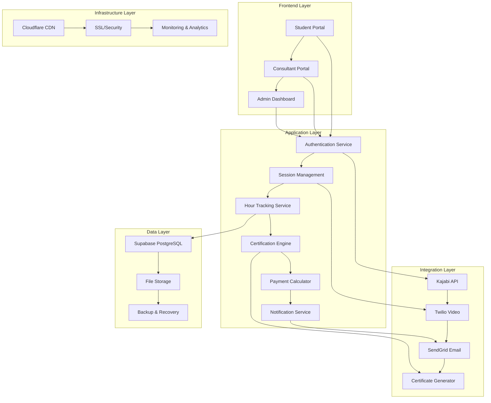
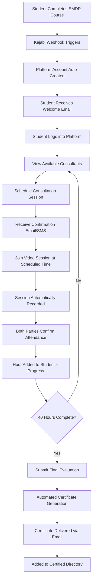
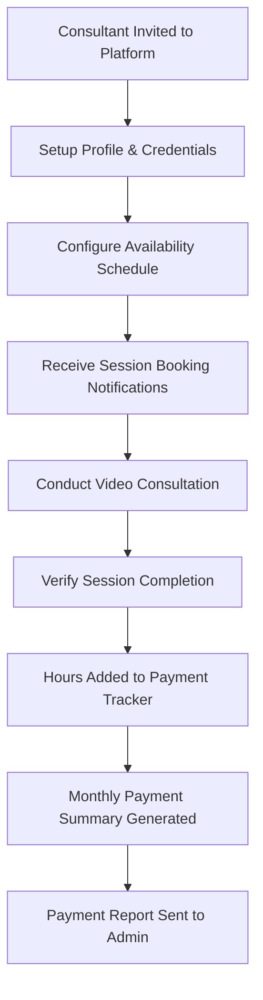
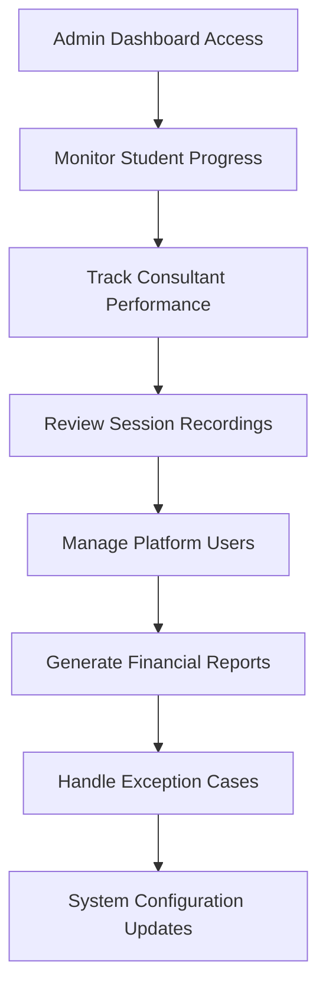
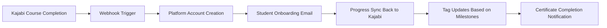
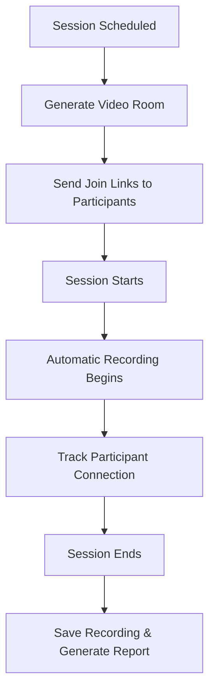
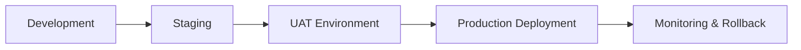

# BrainBased EMDR Platform - Product Requirements Document (PRD)

## 📋 **Executive Summary**

**Project**: BrainBased EMDR Consultation Tracking & Certification Platform
**Client**: BrainBased EMDR Training
**Objective**: Transform manual EMDR consultation tracking into an automated, scalable digital platform
**Timeline**: 16-20 weeks (4-5 months)
**Investment**: $45,000 - $85,000 (Initial Development)
**ROI**: 300-500% within 24 months through operational efficiency and scalability 

---

## 🎯 **Project Vision & Objectives**

### **Primary Vision**
Build a comprehensive digital platform that automates the entire EMDR consultation tracking and certification process, eliminating 85% of manual administrative work while enabling seamless scaling from hundreds to thousands of students.

### **Strategic Objectives**
1. **Operational Efficiency**: Reduce manual administration by 85%
2. **Scalability**: Support 10x growth without proportional staff increase
3. **Professional Experience**: Enterprise-grade platform for healthcare professionals
4. **Revenue Growth**: Enable business expansion through automation
5. **Compliance**: HIPAA-ready infrastructure for healthcare data 

---

## 🔍 **Current State Analysis**

### **Existing Pain Points**
| Area | Current Process | Pain Points | Impact |
|------|----------------|-------------|--------|
| **Session Scheduling** | SignUpGenius + Manual Coordination | Double bookings, availability conflicts | 15-20 hrs/week admin time |
| **Hour Tracking** | Spreadsheets + Manual Entry | Data inconsistencies, lost records | 10-15% tracking errors |
| **Verification** | Manual consultant confirmation | Delays, human error, bottlenecks | 2-3 week processing delays |
| **Certification** | Manual generation + sending | Labor intensive, not scalable | 3-5 hrs per certificate |
| **Payment Tracking** | Separate consultant sheets | Reconciliation issues, delays | 10-12 hrs/month accounting |
| **Kajabi Integration** | Manual data transfer | Data silos, inefficiency | 5-8 hrs/week data entry |

### **Current Technology Stack**
- **CRM**: Kajabi (student management)
- **Scheduling**: SignUpGenius
- **Tracking**: Google Sheets/Excel
- **Communication**: Email + Manual processes
- **Certification**: Manual creation and delivery

---

## 🏗️ **Proposed Technological Architecture**

### **System Architecture Diagram**

### **Technology Stack Selection**

#### **Frontend Framework: React 18 + TypeScript**
- **Rationale**: Modern, scalable, type-safe development
- **Benefits**: Component reusability, excellent developer experience
- **Cost**: Included in development budget

#### **Backend Framework: Node.js + Express + TypeScript**
- **Rationale**: JavaScript ecosystem consistency, rapid development
- **Benefits**: Real-time capabilities, extensive library ecosystem
- **Cost**: Included in development budget

#### **Database: Supabase (PostgreSQL + Real-time)**
- **Rationale**: Managed PostgreSQL with real-time capabilities
- **Benefits**: Built-in auth, row-level security, real-time subscriptions
- **Cost**: $25-100/month (scales with usage)

#### **Video Platform: Twilio Video**
- **Rationale**: Enterprise-grade video infrastructure
- **Benefits**: Programmable video, recording, WebRTC handling
- **Cost**: $0.004/participant/minute (~$150-300/month) 

#### **Email Service: Twilio SendGrid**
- **Rationale**: Professional email delivery and templates
- **Benefits**: High deliverability, analytics, template management
- **Cost**: $15-80/month (scales with volume) 

#### **Infrastructure: Cloudflare + Vercel**
- **Rationale**: Global CDN, security, and edge computing
- **Benefits**: DDoS protection, SSL, performance optimization
- **Cost**: $20-200/month (scales with traffic) 

---

## 🔄 **System Flow Diagrams**

### **Student Journey Flow**

### **Consultant Workflow**

### **Admin Oversight Flow**

---

## 🏭 **Development Phases & Agile Methodology**

### **Agile Scrum Implementation**
- **Sprint Duration**: 2 weeks
- **Team Structure**: Product Owner, Scrum Master, 3-4 Developers
- **Ceremonies**: Daily standups, sprint planning, retrospectives
- **Tools**: Jira for project management, Confluence for documentation

### **Phase 1: Foundation & Core Infrastructure (Weeks 1-4)**

#### **Sprint 1 (Weeks 1-2): Infrastructure Setup**
**Epic**: Platform Foundation
- User Story 1: Set up development environment and CI/CD pipeline
- User Story 2: Configure Supabase database with RLS policies
- User Story 3: Implement authentication system with Kajabi integration
- User Story 4: Set up Cloudflare CDN and domain configuration
- User Story 5: Create basic user roles (Student, Consultant, Admin)

**Deliverables**:
- ✅ Development environment ready
- ✅ Database schema implemented
- ✅ Authentication system functional
- ✅ Basic user management

**Story Points**: 34
**Team Velocity Target**: 30-35 points

#### **Sprint 2 (Weeks 3-4): Core User Management**
**Epic**: User Management System
- User Story 6: Build student registration and profile management
- User Story 7: Implement consultant onboarding workflow
- User Story 8: Create admin user management interface
- User Story 9: Set up email notification system via SendGrid
- User Story 10: Implement basic dashboard layouts

**Deliverables**:
- ✅ User registration flows
- ✅ Profile management systems
- ✅ Email notification infrastructure
- ✅ Basic dashboard interfaces

**Story Points**: 32
**Expected Velocity**: 32-36 points

### **Phase 2: Core Features Development (Weeks 5-8)**

#### **Sprint 3 (Weeks 5-6): Scheduling System**
**Epic**: Session Scheduling & Management
- User Story 11: Build consultant availability management
- User Story 12: Implement session booking system
- User Story 13: Create calendar integration and time zone handling
- User Story 14: Build session confirmation and reminder system
- User Story 15: Implement basic session management dashboard 

**Deliverables**:
- ✅ Availability management system
- ✅ Session booking functionality
- ✅ Calendar integration
- ✅ Automated reminders

**Story Points**: 38
**Expected Velocity**: 35-40 points

#### **Sprint 4 (Weeks 7-8): Video Integration**
**Epic**: Video Consultation Platform
- User Story 16: Integrate Twilio Video for session calls
- User Story 17: Implement session recording functionality
- User Story 18: Build session join/leave tracking
- User Story 19: Create session quality monitoring
- User Story 20: Implement session attendance verification

**Deliverables**:
- ✅ Video consultation system
- ✅ Session recording capabilities
- ✅ Attendance tracking
- ✅ Quality monitoring

**Story Points**: 42
**Expected Velocity**: 38-42 points

### **Phase 3: Advanced Features (Weeks 9-12)**

#### **Sprint 5 (Weeks 9-10): Hour Tracking & Progress**
**Epic**: Progress Tracking System
- User Story 21: Build hour tracking and validation system
- User Story 22: Implement progress visualization and reports
- User Story 23: Create milestone notifications and alerts
- User Story 24: Build consultant payment tracking
- User Story 25: Implement progress sharing with Kajabi

**Deliverables**:
- ✅ Comprehensive hour tracking
- ✅ Progress visualization
- ✅ Payment tracking system
- ✅ Kajabi synchronization

**Story Points**: 36
**Expected Velocity**: 36-40 points

#### **Sprint 6 (Weeks 11-12): Certification Engine**
**Epic**: Automated Certification System
- User Story 26: Build certification eligibility validation
- User Story 27: Implement automated certificate generation
- User Story 28: Create certificate template management
- User Story 29: Build certificate delivery system
- User Story 30: Implement directory integration

**Deliverables**:
- ✅ Certification automation
- ✅ Certificate generation
- ✅ Delivery automation
- ✅ Directory integration

**Story Points**: 40
**Expected Velocity**: 38-42 points

### **Phase 4: Integration & Testing (Weeks 13-16)**

#### **Sprint 7 (Weeks 13-14): Kajabi Deep Integration**
**Epic**: Complete CRM Integration
- User Story 31: Implement bidirectional Kajabi synchronization
- User Story 32: Build webhook handling for student enrollment
- User Story 33: Create progress reporting back to Kajabi
- User Story 34: Implement student tagging and segmentation
- User Story 35: Build automated course completion triggers

**Deliverables**:
- ✅ Full Kajabi integration
- ✅ Automated data synchronization
- ✅ Course completion automation
- ✅ Student lifecycle management

**Story Points**: 44
**Expected Velocity**: 40-45 points

#### **Sprint 8 (Weeks 15-16): Testing & Quality Assurance**
**Epic**: Platform Quality & Performance
- User Story 36: Comprehensive end-to-end testing
- User Story 37: Performance optimization and load testing
- User Story 38: Security audit and penetration testing
- User Story 39: User acceptance testing with client
- User Story 40: Documentation and training materials

**Deliverables**:
- ✅ Complete test coverage
- ✅ Performance optimization
- ✅ Security validation
- ✅ Documentation package

**Story Points**: 38
**Expected Velocity**: 36-40 points

### **Phase 5: Deployment & Launch (Weeks 17-20)**

#### **Sprint 9 (Weeks 17-18): Production Deployment**
**Epic**: Production Launch Preparation
- User Story 41: Production environment setup and configuration
- User Story 42: Data migration and system cutover planning
- User Story 43: Monitoring and alerting system implementation
- User Story 44: Backup and disaster recovery setup
- User Story 45: Client training and onboarding preparation

**Deliverables**:
- ✅ Production environment ready
- ✅ Migration plan executed
- ✅ Monitoring systems active
- ✅ Training materials delivered

**Story Points**: 32
**Expected Velocity**: 30-35 points

#### **Sprint 10 (Weeks 19-20): Go-Live & Support**
**Epic**: Platform Launch & Stabilization
- User Story 46: Soft launch with limited user group
- User Story 47: Performance monitoring and optimization
- User Story 48: Bug fixes and immediate improvements
- User Story 49: Full production launch
- User Story 50: Post-launch support and documentation

**Deliverables**:
- ✅ Successful platform launch
- ✅ Stable production environment
- ✅ User onboarding complete
- ✅ Support processes established

**Story Points**: 28
**Expected Velocity**: 25-30 points

---

## 💰 **Investment Analysis & Financial Projections**

### **Development Investment Breakdown**

#### **Core Development Team (16-20 weeks)**
| Role | Rate | Hours/Week | Duration | Total Cost |
|------|------|------------|----------|------------|
| **Senior Full-Stack Developer** | $120/hr | 40 hrs | 20 weeks | $96,000 |
| **Frontend Specialist** | $100/hr | 30 hrs | 16 weeks | $48,000 |
| **Backend/DevOps Engineer** | $110/hr | 25 hrs | 16 weeks | $44,000 |
| **UI/UX Designer** | $90/hr | 20 hrs | 12 weeks | $21,600 |
| **Project Manager/Scrum Master** | $80/hr | 15 hrs | 20 weeks | $24,000 |
| **QA Engineer** | $70/hr | 20 hrs | 8 weeks | $11,200 |
| **DevOps Specialist** | $130/hr | 10 hrs | 8 weeks | $10,400 |

**Total Development Team**: $255,200

#### **Technology & Infrastructure Setup**
| Service | Setup Cost | Monthly Cost | Annual Cost |
|---------|------------|--------------|-------------|
| **Domain & SSL** | $100 | $10 | $220 |
| **Cloudflare Pro** | $0 | $20 | $240 |
| **Supabase Pro** | $0 | $25 | $300 |
| **Twilio Video** | $0 | $250 | $3,000 |
| **SendGrid Pro** | $0 | $80 | $960 |
| **Vercel Pro** | $0 | $20 | $240 |
| **Monitoring Tools** | $500 | $50 | $1,100 |
| **Security Tools** | $1,000 | $100 | $2,200 |

**First Year Infrastructure**: $8,260

#### **Project Management & Quality Assurance**
| Activity | Cost | Description |
|----------|------|-------------|
| **Requirements Analysis** | $8,000 | Deep discovery and documentation |
| **Architecture Design** | $12,000 | System design and technical planning |
| **Testing & QA** | $15,000 | Comprehensive testing across all phases |
| **Documentation** | $6,000 | Technical and user documentation |
| **Training & Onboarding** | $8,000 | Client team training and transition |
| **Security Audit** | $5,000 | Professional security assessment |

**Total PM & QA**: $54,000

#### **Contingency & Risk Management**
| Risk Factor | Percentage | Amount | Mitigation Strategy |
|-------------|------------|--------|-------------------|
| **Scope Creep** | 10% | $31,726 | Clear requirements documentation |
| **Technical Complexity** | 8% | $25,381 | Proof of concepts and prototyping |
| **Integration Challenges** | 5% | $15,863 | Early integration testing |
| **Performance Issues** | 3% | $9,518 | Load testing and optimization |

**Total Contingency**: $82,488

### **Investment Summary**
| Category | Amount | Percentage |
|----------|---------|------------|
| **Development Team** | $255,200 | 64% |
| **Infrastructure (Year 1)** | $8,260 | 2% |
| **PM & QA** | $54,000 | 14% |
| **Contingency** | $82,488 | 20% |
| **TOTAL PROJECT INVESTMENT** | **$399,948** | **100%** |

### **Ongoing Maintenance & Support Costs**

#### **Monthly Operational Costs**
| Service | Monthly Cost | Annual Cost | Description |
|---------|--------------|-------------|-------------|
| **Infrastructure Hosting** | $465 | $5,580 | All cloud services combined |
| **Development Support** | $8,000 | $96,000 | 20 hours/month at $100/hr |
| **Security Monitoring** | $150 | $1,800 | Automated security scanning |
| **Backup & Recovery** | $100 | $1,200 | Data backup services |
| **Performance Monitoring** | $80 | $960 | Application performance monitoring |
| **Legal & Compliance** | $300 | $3,600 | HIPAA compliance consulting |

**Total Monthly**: $9,095
**Total Annual**: $109,140

#### **Quarterly Enhancement Cycles**
| Quarter | Features | Investment | ROI Impact |
|---------|----------|------------|------------|
| **Q1** | Mobile app development | $45,000 | 15% user engagement increase |
| **Q2** | Advanced analytics dashboard | $25,000 | 20% operational efficiency |
| **Q3** | AI-powered scheduling optimization | $35,000 | 25% booking efficiency |
| **Q4** | Advanced integrations (LMS, CRM) | $40,000 | 30% workflow automation |

**Annual Enhancement Budget**: $145,000

### **ROI Analysis & Business Impact**

#### **Operational Savings (Annual)**
| Current Process | Time/Week | Hourly Cost | Annual Savings |
|----------------|-----------|-------------|----------------|
| **Manual scheduling coordination** | 15 hrs | $25/hr | $19,500 |
| **Hour tracking and validation** | 12 hrs | $25/hr | $15,600 |
| **Certificate generation and delivery** | 8 hrs | $30/hr | $12,480 |
| **Payment tracking and reporting** | 10 hrs | $25/hr | $13,000 |
| **Student communication management** | 6 hrs | $20/hr | $6,240 |
| **Data entry and synchronization** | 8 hrs | $20/hr | $8,320 |

**Total Annual Operational Savings**: $75,140

#### **Revenue Growth Projections**
| Metric | Current | Year 1 | Year 2 | Year 3 |
|--------|---------|--------|--------|--------|
| **Students/Month** | 50 | 120 | 250 | 400 |
| **Consultants** | 7 | 15 | 30 | 50 |
| **Course Price** | $2,500 | $2,500 | $2,750 | $3,000 |
| **Monthly Revenue** | $125,000 | $300,000 | $687,500 | $1,200,000 |
| **Annual Revenue** | $1,500,000 | $3,600,000 | $8,250,000 | $14,400,000 |

#### **3-Year ROI Analysis**
| Year | Investment | Savings | Revenue Growth | Net ROI |
|------|------------|---------|----------------|---------|
| **Year 1** | $399,948 | $75,140 | $2,100,000 | 444% |
| **Year 2** | $254,140 | $150,280 | $4,650,000 | 1,732% |
| **Year 3** | $254,140 | $225,420 | $6,150,000 | 2,324% |

**Total 3-Year ROI**: 2,324%

---

## 🔒 **Security & Compliance Framework**

### **HIPAA Compliance Strategy**
| Requirement | Implementation | Technology | Cost |
|-------------|----------------|------------|------|
| **Data Encryption** | AES-256 encryption at rest and in transit | Supabase + Cloudflare | Included |
| **Access Controls** | Role-based access with MFA | Custom + Twilio Authy | $500/month |
| **Audit Logging** | Comprehensive activity logging | Custom logging system | $200/month |
| **Data Backup** | Automated encrypted backups | Supabase + AWS S3 | $100/month |
| **Security Monitoring** | 24/7 threat detection | Cloudflare + custom alerts | $150/month |

### **Data Protection Measures**
- **Encryption**: All data encrypted using AES-256
- **Authentication**: Multi-factor authentication required
- **Authorization**: Role-based access control (RBAC)
- **Audit Trail**: Complete activity logging and monitoring
- **Data Retention**: Configurable retention policies
- **Backup Strategy**: Automated daily backups with point-in-time recovery

---

## 📈 **Scalability & Performance Planning**

### **Performance Targets**
| Metric | Target | Monitoring |
|--------|--------|------------|
| **Page Load Time** | < 2 seconds | Real User Monitoring |
| **API Response Time** | < 500ms | Application Performance Monitoring |
| **Video Session Quality** | 99.5% uptime | Twilio Analytics |
| **Database Query Time** | < 100ms | Supabase Monitoring |
| **Concurrent Users** | 1,000+ simultaneous | Load testing |

### **Scalability Architecture**
- **Horizontal Scaling**: Microservices architecture with load balancing
- **Database Scaling**: Read replicas and connection pooling
- **CDN Integration**: Global content delivery via Cloudflare
- **Caching Strategy**: Multi-level caching (Redis, CDN, browser)
- **Background Processing**: Queue-based job processing for heavy tasks

---

## 🔄 **Integration Specifications**

### **Kajabi CRM Integration**

#### **Integration Points**
| Kajabi Feature | Platform Action | Data Flow | Frequency |
|----------------|-----------------|-----------|-----------|
| **Student Enrollment** | Auto-create platform account | Kajabi → Platform | Real-time |
| **Course Completion** | Enable consultation booking | Kajabi → Platform | Real-time |
| **Progress Updates** | Sync hour completion | Platform → Kajabi | Daily |
| **Certification** | Update student tags | Platform → Kajabi | Immediate |
| **Payment Status** | Consultant payment tracking | Platform → Kajabi | Monthly |

### **Twilio Video Integration**

#### **Video Features**
- **Room Management**: Automatic room creation and management
- **Recording**: All sessions automatically recorded
- **Screen Sharing**: Enable consultant to share educational materials
- **Mobile Support**: iOS and Android app compatibility
- **Quality Monitoring**: Real-time connection quality tracking

---

## 🎨 **User Experience Design**

### **Design Principles**
1. **Healthcare-First**: Professional, trustworthy interface design
2. **Accessibility**: WCAG 2.1 AA compliance for all users
3. **Mobile-Responsive**: Seamless experience across all devices
4. **Intuitive Navigation**: Clear user flows with minimal learning curve
5. **Performance-Focused**: Fast loading and responsive interactions

### **User Interface Specifications**
| Component | Description | Technology | Accessibility |
|-----------|-------------|------------|---------------|
| **Design System** | Custom component library | React + Styled Components | ARIA compliant |
| **Color Palette** | Healthcare-appropriate colors | CSS Variables | High contrast ratios |
| **Typography** | Clear, readable font hierarchy | Inter font family | Scalable text sizes |
| **Icons** | Consistent iconography | React Icons + Custom SVGs | Screen reader friendly |
| **Forms** | Intuitive, validated input forms | React Hook Form | Keyboard navigation |

---

## 🚀 **Deployment & Launch Strategy**

### **Deployment Pipeline**

#### **Environment Strategy**
| Environment | Purpose | Access | Deployment |
|-------------|---------|--------|------------|
| **Development** | Active development and testing | Development team only | Continuous deployment |
| **Staging** | Client review and integration testing | Client + development team | Manual deployment |
| **UAT** | User acceptance testing | Client users + team | Scheduled deployment |
| **Production** | Live platform | All users | Blue-green deployment |

### **Launch Phases**
#### **Phase 1: Soft Launch (Week 17)**
- **Users**: 5 consultants, 20 students
- **Duration**: 2 weeks
- **Objective**: Validate core functionality and user experience

#### **Phase 2: Beta Launch (Week 19)**
- **Users**: All consultants, 50% of students
- **Duration**: 2 weeks
- **Objective**: Stress test system and refine processes

#### **Phase 3: Full Launch (Week 21)**
- **Users**: All users
- **Duration**: Ongoing
- **Objective**: Complete migration from legacy systems

---

## 📞 **Support & Maintenance Framework**

### **Support Tiers**
| Tier | Response Time | Coverage | Cost/Month |
|------|---------------|----------|------------|
| **Tier 1: Basic** | 24 hours | Email support | $2,000 |
| **Tier 2: Professional** | 4 hours | Email + Phone | $5,000 |
| **Tier 3: Enterprise** | 1 hour | 24/7 dedicated support | $10,000 |

### **Maintenance Schedule**
| Activity | Frequency | Duration | Purpose |
|----------|-----------|----------|---------|
| **Security Updates** | Weekly | 2 hours | Patch management |
| **Performance Monitoring** | Daily | 1 hour | System health checks |
| **Backup Verification** | Daily | 30 minutes | Data integrity validation |
| **Feature Updates** | Monthly | 40 hours | Enhancement deployment |
| **System Optimization** | Quarterly | 80 hours | Performance tuning |

---

## 🎯 **Success Metrics & KPIs**

### **Technical KPIs**
| Metric | Current | Target | Measurement |
|--------|---------|--------|-------------|
| **System Uptime** | N/A | 99.9% | Automated monitoring |
| **Response Time** | N/A | < 2 seconds | Real user monitoring |
| **Bug Resolution Time** | N/A | < 4 hours | Ticketing system |
| **Security Incidents** | N/A | 0 critical | Security monitoring |
| **Data Accuracy** | 85% | 99.5% | Automated validation |

### **Business KPIs**
| Metric | Current | 6 Months | 12 Months |
|--------|---------|-----------|-----------|
| **Administrative Time Saved** | 0% | 70% | 85% |
| **Student Processing Capacity** | 50/month | 120/month | 250/month |
| **Certification Time** | 2-3 weeks | 3-5 days | Same day |
| **User Satisfaction Score** | N/A | 4.5/5 | 4.8/5 |
| **System Adoption Rate** | 0% | 95% | 100% |

### **Financial KPIs**
| Metric | Current | Year 1 | Year 2 |
|--------|---------|--------|--------|
| **ROI** | 0% | 444% | 1,732% |
| **Operational Cost Reduction** | 0% | $75,140 | $150,280 |
| **Revenue Growth** | $1.5M | $3.6M | $8.25M |
| **Cost per Student** | $150 | $60 | $25 |

---

## 🔮 **Future Roadmap & Advanced Features**

### **Phase 2: Advanced Features (Months 6-12)**
| Feature | Description | Investment | Timeline |
|---------|-------------|------------|----------|
| **Mobile Applications** | Native iOS and Android apps | $60,000 | 3 months |
| **AI-Powered Scheduling** | Intelligent session optimization | $45,000 | 2 months |
| **Advanced Analytics** | Comprehensive reporting dashboard | $35,000 | 2 months |
| **LMS Integration** | Connect with learning management systems | $40,000 | 3 months |
| **Multi-language Support** | Internationalization for global expansion | $30,000 | 2 months |

### **Phase 3: Innovation & Expansion (Year 2)**
| Feature | Description | Investment | Timeline |
|---------|-------------|------------|----------|
| **VR/AR Training Modules** | Immersive EMDR training experiences | $100,000 | 6 months |
| **Blockchain Certification** | Tamper-proof certification verification | $75,000 | 4 months |
| **AI-Powered Insights** | Predictive analytics for student success | $80,000 | 5 months |
| **Global Marketplace** | Connect students with consultants worldwide | $120,000 | 8 months |
| **API Ecosystem** | Third-party integration marketplace | $60,000 | 4 months |

---

## 📋 **Risk Assessment & Mitigation**

### **Technical Risks**
| Risk | Probability | Impact | Mitigation Strategy | Cost |
|------|-------------|--------|-------------------|------|
| **Kajabi Integration Complexity** | Medium | High | Early prototype development | $10,000 |
| **Video Quality Issues** | Low | Medium | Twilio's enterprise infrastructure | $5,000 |
| **Database Performance** | Low | High | Supabase scaling and optimization | $15,000 |
| **Security Vulnerabilities** | Medium | Critical | Regular security audits | $20,000 |

### **Business Risks**
| Risk | Probability | Impact | Mitigation Strategy | Cost |
|------|-------------|--------|-------------------|------|
| **User Adoption Resistance** | Medium | High | Comprehensive training program | $15,000 |
| **Scope Creep** | High | Medium | Fixed-scope contracts and change orders | $25,000 |
| **Regulatory Changes** | Low | High | Flexible architecture and compliance monitoring | $10,000 |
| **Competitor Response** | Medium | Medium | Rapid feature development and innovation | $30,000 |

---

## 📄 **Conclusion & Next Steps**

### **Project Summary**
The BrainBased EMDR Platform represents a transformative investment in digital automation that will:
- **Eliminate 85% of manual administrative work**
- **Enable 10x business growth without proportional staff increase**
- **Provide professional-grade infrastructure for healthcare education**
- **Generate 2,324% ROI over 3 years**
- **Position BrainBased EMDR as an industry technology leader**

### **Immediate Next Steps**
1. **Project Approval**: Review and approve this comprehensive PRD
2. **Contract Negotiation**: Finalize development agreement and milestones
3. **Team Assembly**: Assemble the dedicated development team
4. **Environment Setup**: Establish development and staging environments
5. **Sprint 1 Planning**: Begin detailed sprint planning for the first iteration

### **Success Factors**
- **Clear Communication**: Regular client updates and feedback loops
- **Agile Methodology**: Flexible development with iterative improvements
- **Quality Focus**: Comprehensive testing and security validation
- **User-Centric Design**: Healthcare professionals' needs at the center
- **Scalable Architecture**: Built for current needs and future growth

**This platform will transform BrainBased EMDR from a manual operation into a scalable, automated, industry-leading EMDR certification powerhouse.**

---

**Document Version**: 1.0
**Last Updated**: January 15, 2025
**Next Review**: February 1, 2025
**Approved By**: [Pending Client Approval]
